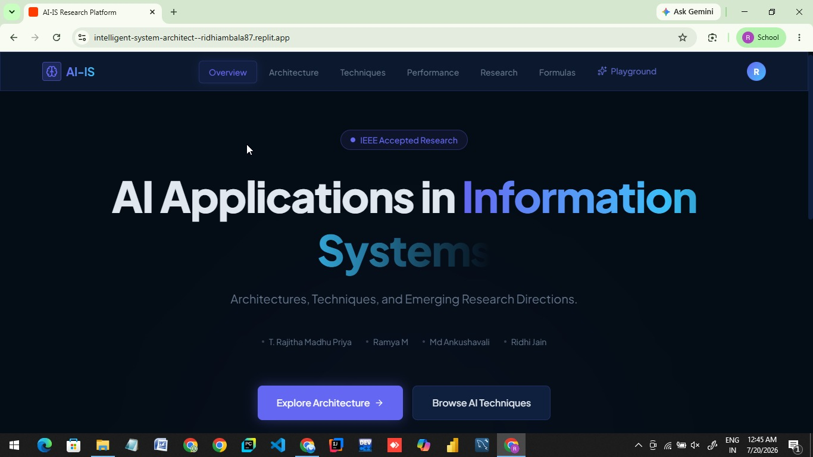
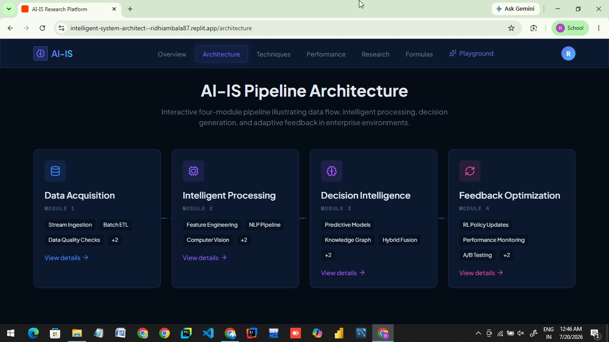
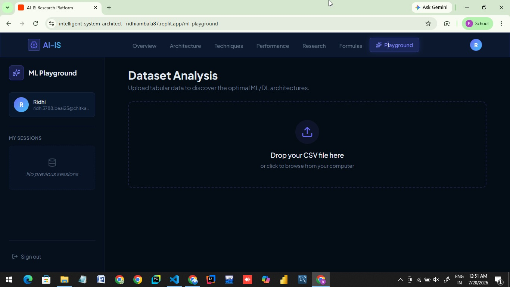

# 🤖 AI-IS Research Platform

An interactive AI-powered educational platform that explores **Artificial Intelligence Applications in Information Systems**. The platform provides detailed information about AI architectures, techniques, performance evaluation, research directions, mathematical formulas, and an interactive ML playground.

---

## 📌 Features

- 🏠 Modern Landing Page
- 🧠 AI Architecture Overview
- ⚙️ AI Techniques
- 📈 Performance Analysis
- 📚 Research Section
- 🧮 Mathematical Formulas
- 🎮 Interactive ML Playground
- 🔐 User Authentication
- 📱 Responsive UI
- 🌙 Modern Dark Theme

---

## 🛠️ Tech Stack

### Frontend
- React
- TypeScript
- Vite
- Tailwind CSS
- Wouter
- React Query
- Radix UI
- Framer Motion

### Backend
- Node.js
- Express.js
- TypeScript

### Database
- PostgreSQL
- Drizzle ORM

### Authentication
- Express Session
- PostgreSQL Session Store

### Deployment
- Replit Deployments

---

## 📂 Project Structure

```
Intelligent-System-Architect/
│
├── api-server/                 # Express Backend
├── artifacts/
│   └── ai-is-platform/         # React Frontend
├── lib/                        # Shared Libraries
├── scripts/
├── pnpm-workspace.yaml
└── package.json
```

---

## 🚀 Installation

### Clone Repository

```bash
git clone https://github.com/ridhiambala87/ai-is-platform.git
```

Go into the project

```bash
cd Intelligent-System-Architect
```

Install dependencies

```bash
pnpm install
```

Run the project

```bash
pnpm dev
```

---

## 📸 Screenshots

### Home Page



### Architecture



### Playground



---

## 📖 Modules

- Overview
- AI Architectures
- AI Techniques
- Performance Metrics
- Research Papers
- Mathematical Formulas
- ML Playground
- Authentication

---

## 🎯 Objectives

- Provide an educational platform for AI in Information Systems.
- Present modern AI architectures and techniques.
- Explore current IEEE research trends.
- Offer an interactive learning experience.
- Demonstrate practical AI concepts through examples.

---

## 📚 Future Enhancements

- AI Chatbot Integration
- Research Paper Recommendation System
- Quiz Module
- Progress Tracking
- User Dashboard
- Certificate Generation
- Admin Panel
- Dark/Light Theme Toggle

---

## 🌐 Live Demo

**Replit Deployment**

https://intelligent-system-architect--ridhiambala87.replit.app

---

## 📂 GitHub Repository

https://github.com/ridhiambala87/ai-is-platform

---

## 📄 License

This project is developed for educational and research purposes.

---

## ⭐ Support

If you found this project helpful, please consider giving it a ⭐ on GitHub.

---

Made by Ridhi Jain
